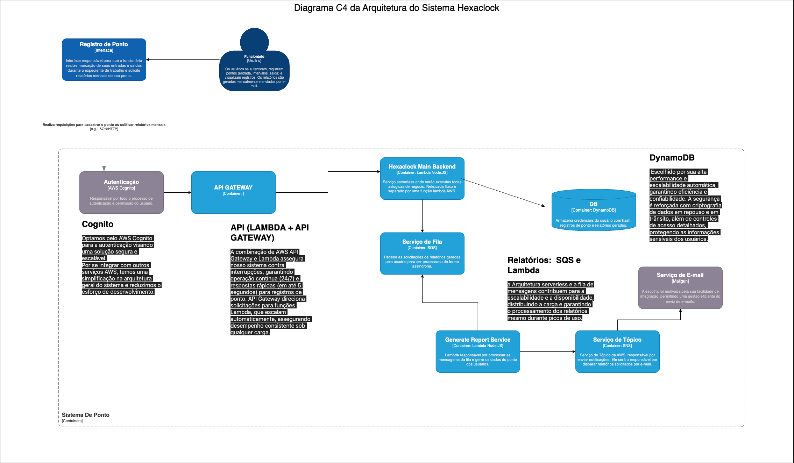
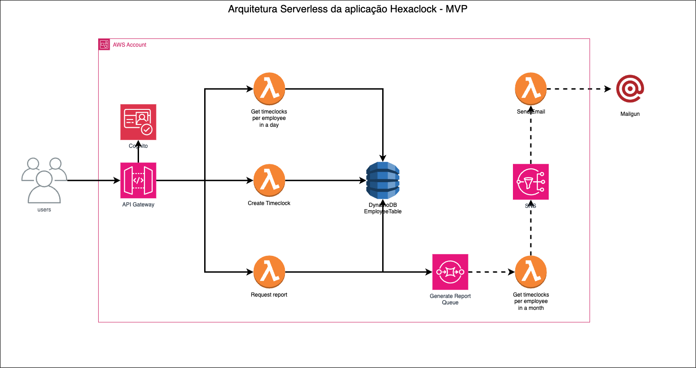
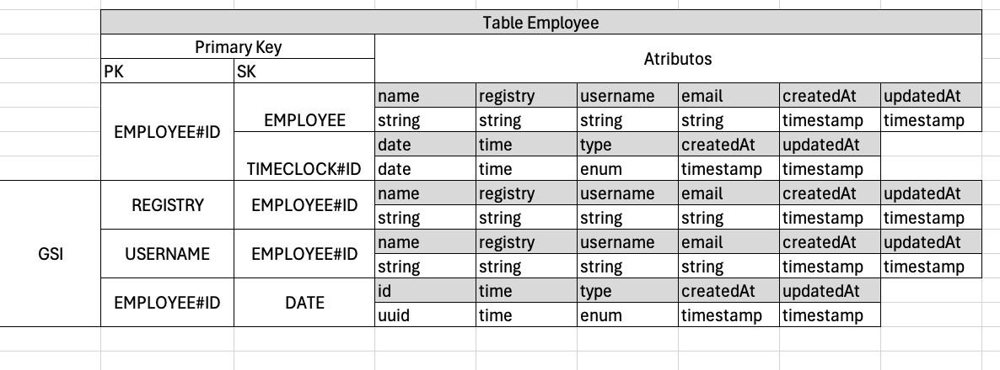
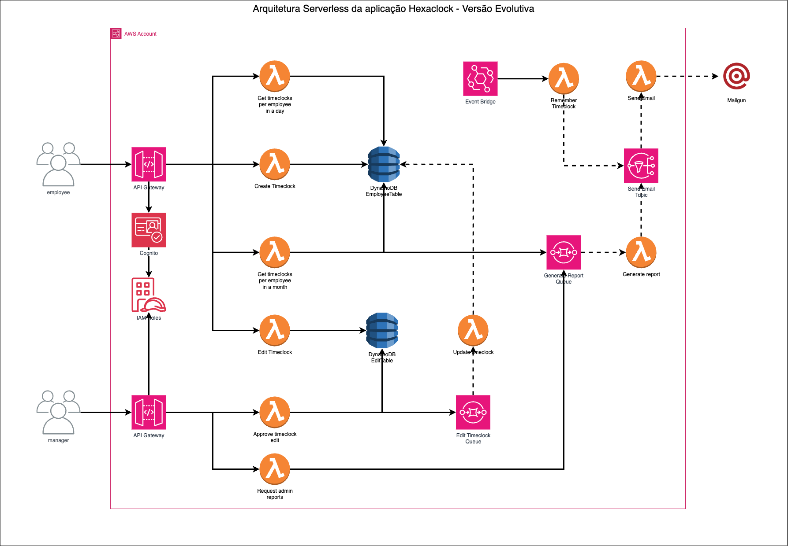
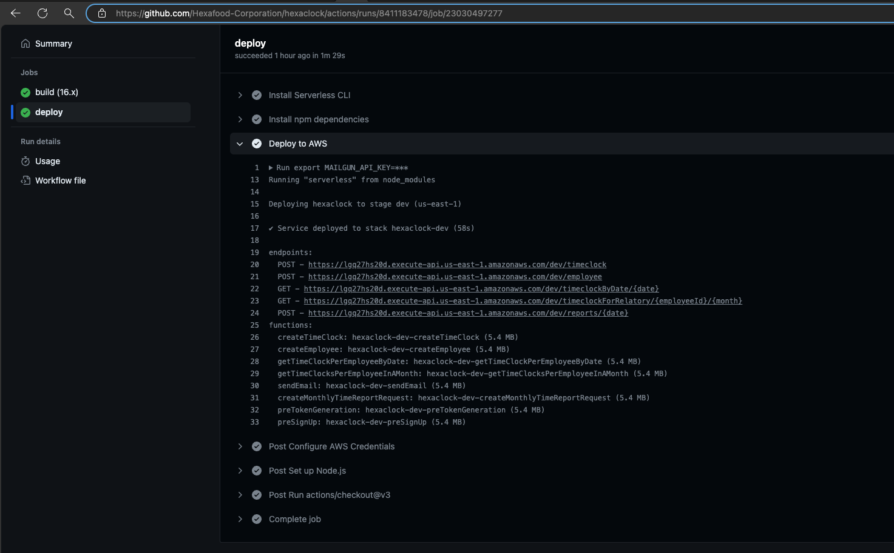

<h1 align="center">
    Hexaclock - Hackaton FIAP - SOAT1
</h1>

## Índice

- <a href="#boat-sobre-o-projeto">:boat: Sobre o projeto</a>
- <a href="#hammer-tecnologias">:hammer: Tecnologias</a>
- <a href="#world_map-desenho-da-solução-mvp">:world_map: Desenho da Solução MVP</a>
  - <a href="#white_check_mark-diagrama-c4-da-arquitetura">:white_check_mark: Diagrama C4 da Arquitetura</a>
  - <a href="#airplane-diagrama-de-arquitetura-na-aws">:airplane: Diagrama de Arquitetura na AWS</a>
  - <a href="#roller_coaster-modelagem-de-dados-nosql-com-dynamodb">:roller_coaster: Modelagem de Dados NoSQL com DynamoDB</a>
- <a href="#chart_with_upwards_trend-desenho-da-solução-evolutiva">:chart_with_upwards_trend: Desenho da Solução Evolutiva</a>
- <a href="#cd-esteira-cicd">:cd: Esteira CI/CD</a>
- <a href="#bookmark_tabs-licença">:bookmark_tabs: Licença</a>
- <a href="#wink-autores">:wink: Autores</a>

## :boat: Sobre o projeto

Este projeto faz parte do trabalho "Desafio Hackaton - Software Architecture", aplicado como requisito final do curso de Pós Graduação Software Architecture da FIAP em parceria com a Alura.

Foi proposto um desafio no qual deveria-se arquitetar e implementar uma infraestrutura backend em cloud, para atender um sistema de marcação de pontos eletrônicos. No decorrer deste documento, estão listadas como foram atendidos cada requisito do trababalho, bem como a fundamentação das decisões técnicas tomadas no escopo deste projeto.

## :hammer: Tecnologias:
- **[Node.js](https://nodejs.org/)**
- **[Serverless Framework](https://www.serverless.com/)**
- **[Amazon DynamoDB](https://aws.amazon.com/pt/pm/dynamodb/)**
- **[AWS Lambda](https://aws.amazon.com/pt/pm/lambda/)**
- **[AWS Cognito](https://aws.amazon.com/pt/pm/cognito/)**
- **[AWS API Gateway](https://aws.amazon.com/pt/api-gateway/)**
- **[AWS SQS](https://aws.amazon.com/pt/sqs/)**
- **[AWS SNS](https://aws.amazon.com/pt/sns/)**
- **[Mailgun](https://www.mailgun.com/)**

## :world_map: Desenho da Solução MVP

O objetivo do desafio é projetar um sistema de ponto eletrônico cloud native, que suporte grande cargas requisições em horários pico, tendo um tempo de resposta máximo de 5 segundos. O sistema também deve ficar disponível 24 horas e 7 dias por semana. 

O sistema foi dividido em duas partes, sendo a primeira parte um MVP com as seguintes funcionalidades:

* O sistema deve permitir que os usuários se autentiquem;
* O sistema deve permitir que usuários autenticados registrem seus pontos eletrônicos de entrada e saída;
* O sistema deve permitir que os usuários autenticados visualizem seus pontos marcados em um dia;
* O sistema deve permitir que usuários autenticados gerem um relatório com o espelho mensal dos seus pontos, calculando as horas trabalhadas;
* O sistema não deve permitir que usuários visualizem informações de outros usuários;

Tendo em vista o conhecimento obtido no curso em utilizar recursos da AWS, optou-se por desenvolver um sistema em Arquitetura Serverless. Para aumentar ainda mais a produtividade do time, optou-se por utilizar o Serverless Framework que facilita a alocação de recursos da AWS integrando facilmente a aplicação desenvolvida com o IaC (Infrastructure as code) da mesma. 

Além disso, a arquitetura serverless traz vantagens para solução de negócio, pois temos sistema vai precisar ser usado principalmentem em horários de pico, dessa forma delegamos a responsabilidade de escalabilidade para cloud provider, uma vez que não precisamos se preocupar em manter servidores ativos. 

A complexidade com escabilidade e configuração de servidores são abstraídas por cloud providers, possibilitando que o time de desenvolvimento foquem nas regras de negócios.

### :white_check_mark: Diagrama C4 da Arquitetura
Na imagem a seguir, consta o Diagrama C4 de Arquitetura do Sistema Hexaclock:

 
<h4 align="center">
    
</h4>
 

### :airplane: Diagrama de Arquitetura na AWS

Para provisionamento da infraestrutura do MVP, formulamos a seguinte arquitetura na AWS:

 
<h4 align="center">
    
</h4>
 

Cada endpoint da aplicação é provisionado em uma função lambda separada. Essa abordagem chama-se "Single Responsability Lambda functions", que proporciona as seguintes vantagens:

* Granularidade da visão das solicitações ao sistema;
* Separacão forte responsabilidade de fluxos;
* Execução rápida de cada função, tendo em vista da lambda poder ser carregada apenas com o que é necessário para execução da mesma

É válido destacar que essa abordagem tem algunas desvantagens como a repetição de código, tendo em vista que objetivo é criar fluxos independentes. 

### :roller_coaster: Modelagem de Dados NoSQL com DynamoDB

A modelagem de dados de um banco NoSQL DynamoDB deve ser guiada por perguntas que nossa solução deve responder. Dessa forma, formulamos os GSI(Global Secondary Indexes) antes do banco ir para ser produção, conseguindo consultas mais rápidas e de menor custo.

No Hexaclock, foi provisionado uma table no DynamoDB chamada EmployeeTable. Nela ficam registrados tanto informações dos empregados (employee) como das marcações de ponto (timeclock) realizadas pelos mesmos. A modelagem da tabela NoSQL foi realizada no sentido de atender as seguintes solicitações previstas em requisitos de domínio:

* Obter usuário por username;
* Obter usuário por matrícula (registry);
* Obter marcações de ponto do funcionário no dia;
* Obter marcações de ponto do funcionário no mês

 
<h4 align="center">
    
</h4>
 

## :chart_with_upwards_trend: Desenho da Solução Evolutiva

A fim de atender a evolução prevista no sistema, foi formulado uma nova arquitetura serverless, acrescentando novos recursos como 
* A divisão de papeis no serviço Cognito;
* Acriação de uma nova table para armazenar solicitações de registro de ponto;
* Provisionamento do recurso Event Bridge para ativação de rotinas periódicas como notificações de lembres para marcar ponto aos funcionários

 
<h4 align="center">
    
</h4>
 

## :cd: Esteira CI/CD

O Serverless Framework facilita o deploy do código e da infraestrutura, através do uso de Cloud Formation no arquivo serverless.yml. Então isso possibiliou a criação de uma esteira única que faz o deploy tanto do código como de novos recursos declarados no IaC:

 
<h4 align="center">
    
</h4>
 

## :bookmark_tabs: Licença

Este projeto esta sobe a licença MIT. Veja a [LICENÇA](https://opensource.org/licenses/MIT) para saber mais.

## :wink: Autores

Feito com ❤️ por:

- [Bruno Padilha](https://www.linkedin.com/in/brpadilha/)
- [Lucas Siqueira](https://www.linkedin.com/in/lucassouzatidev/)
- [Marayza Gonzaga](https://www.linkedin.com/in/marayza-gonzaga-7766251b1/)

[Voltar ao topo](#índice)